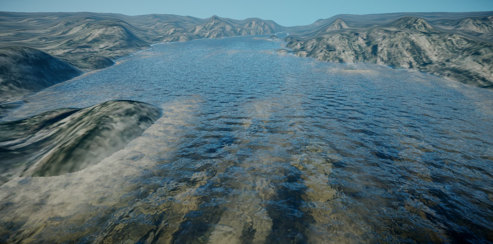

<div align="center">

# Where the River Goes

**A real-time procedural landscape rendered entirely in a single HTML file.**

Originally created by [P_Malin](https://www.shadertoy.com/user/P_Malin) on Shadertoy — ported to a standalone WebGL2 experience.

[](#)
[](#)
[](#)



</div>

---

## Table of Contents

- [About](#about)
- [Features](#features)
- [Quick Start](#quick-start)
- [Project Structure](#project-structure)
- [How It Works](#how-it-works)
- [Controls](#controls)
- [Technical Details](#technical-details)
- [Performance](#performance)
- [Compatibility](#compatibility)
- [Credits](#credits)
- [License](#license)

---

## About

> *A hacked flow and advection experiment that turned into something beautiful.*

This project brings P_Malin's iconic Shadertoy shader to a self-contained HTML file. No build tools. No frameworks. No dependencies. Just open `index.html` in a browser and watch a river carve through procedural terrain in real time.

The entire scene — mountains, riverbed, water surface, foam, reflections, refractions, shadows, and atmospheric fog — is generated mathematically, pixel by pixel, every frame.

---

## Features

| Feature | Description |
|---|---|
| **Raymarched Terrain** | Procedural heightfield using Fractal Brownian Motion (FBM) |
| **Flowing Water** | Animated river with realistic flow rates and meandering |
| **Water Foam** | Dynamic foam generation based on flow velocity and depth |
| **Refraction & Reflection** | Physically-based water surface with Fresnel equations |
| **Cone Stepping** | Accelerated raymarching via heightfield cone optimization |
| **Volumetric Fog** | Exponential distance-based fog with extinction and inscattering |
| **Shadow Mapping** | Soft sun shadows on both terrain and water surface |
| **Triplanar Texturing** | Texture projection without UV seams |
| **Auto Camera** | Smooth camera flythrough following the river path |
| **Mouse Control** | Click and drag to steer the camera |
| **High DPI** | Automatic device pixel ratio scaling |

---

## Quick Start

1. Clone or download the repository
2. Open `index.html` in any modern browser
3. Wait for `texture.jpg` to load
4. Enjoy the scene

> **Note:** A local server may be required for texture loading in some browsers. You can use:
> ```bash
> # Python
> python -m http.server 8000
>
> # Node.js
> npx serve .
> ```

---

## Project Structure

```
.
├── index.html      # Everything: HTML, JavaScript, and GLSL
├── texture.jpg     # Terrain texture sampled via triplanar mapping
└── preview.jpg     # Screenshot of the rendered scene
```

**Single file. Zero configuration.** The fragment shader, vertex shader, WebGL setup, texture loading, and render loop all live inside `index.html`.

---

## How It Works

### Rendering Pipeline

```
Fragment Coord
      │
      ▼
 Camera Ray Generation
      │
      ▼
 ┌─────────────────┐
 │  Raymarch Scene  │ ← Cone stepping acceleration
 └────────┬────────┘
          │
    ┌─────┴─────┐
    │           │
 Terrain     Sky Color
    │
    ▼
 Water Trace ──→ Refraction + Reflection
    │
    ▼
 Lighting (Sun + Sky)
    │
    ▼
 Fog Composition
    │
    ▼
 Vignette + Tonemap
    │
    ▼
   Pixel
```

### Terrain Generation

The landscape is a heightmap built from layered FBM noise. Each octave doubles in frequency and halves in amplitude, creating natural-looking erosion patterns. A riverbed is carved by subtracting depth based on a sinusoidal meander function.

### Water Surface

The water normal is computed via gradient-domain FBM with flow advection. Two noise samples are blended over time to create the illusion of moving water. Foam appears where flow velocity exceeds a threshold or where depth decreases near obstacles.

### Lighting Model

- **Sun light** — Blinn-Phong specular with Cook-Torrance distribution
- **Sky light** — Hemisphere ambient proportional to surface normal
- **Fresnel** — Schlick approximation blending reflection and refraction
- **Shadows** — Secondary raymarch from water/terrain surface toward the sun

---

## Controls

| Input | Action |
|---|---|
| **Mouse drag** | Steer camera heading and distance |
| **Automatic** | Camera follows the river when idle |

---

## Technical Details

| Parameter | Value |
|---|---|
| Raymarch steps | 64 |
| FBM octaves (terrain) | 3 |
| FBM octaves (water) | 4 |
| Water refraction index | 1 / 1.3333 (real water) |
| Far clip | 20.0 units |
| Sun direction | `(-1.0, 0.7, 0.25)` normalized |

### Shader Defines

| Define | Effect |
|---|---|
| `ENABLE_WATER` | Renders the water surface |
| `ENABLE_FOAM` | Adds foam to the water |
| `ENABLE_WATER_RECEIVE_SHADOW` | Shadows cast onto water |
| `ENABLE_CONE_STEPPING` | Accelerates terrain raymarching |

---

## Performance

The shader is computationally intensive by design. Each pixel requires:

- Multiple FBM evaluations for terrain height
- A secondary raymarch for shadows
- Refraction ray bounce
- Reflection ray bounce
- Flow and foam calculations

For smoother performance on lower-end GPUs, consider:

- Reducing `k_raymarchSteps` from 64 to 32
- Disabling `ENABLE_WATER_RECEIVE_SHADOW`
- Removing supersampling if enabled

---

## Compatibility

| Browser | Status |
|---|---|
| Chrome 80+ | ✅ Full support |
| Firefox 80+ | ✅ Full support |
| Edge 80+ | ✅ Full support |
| Safari 15+ | ✅ Full support |
| Mobile browsers | ⚠️ May be slow due to shader complexity |

**Requirements:** WebGL2 (`#version 300 ES`)

---

## Credits

- **Shader Author:** [P_Malin](https://www.shadertoy.com/user/P_Malin) — original "Where the River Goes" on [Shadertoy](https://www.shadertoy.com/view/Xl2XRW)
- **Hash function:** Dave Hoskins — [Hash without Sine](https://www.shadertoy.com/view/4djSRW)
- **Block render technique:** [Shadertoy /ltlSWf](https://www.shadertoy.com/view/ltlSWf)

---

## License

The original shader is authored by P_Malin and hosted on Shadertoy under their terms of use. This WebGL2 port is provided for educational and personal use.

---

<div align="center">

*Every pixel, every frame, computed from pure mathematics.*

</div>
